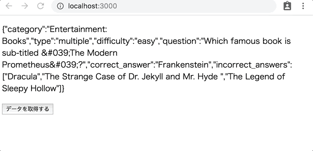

# レポジトリ内容

この課題は、Web白熱教室のReact課題その4「[【エクササイズ】API経由のデータ取得前後で表示を切り替える](https://tsuyopon.xyz/learning-contents/web-dev/javascript/react/js-exercise-for-react-4/)」の課題レポジトリになります。

## 課題

- 以下の完成形の画像と同じ見た目になるように実装する
- 具体的な実装の流れは、以下の「課題をクリアするためのステップ」の内容を参考にすること

## 完成形

### 課題をクリアするためのステップ

- [ ] `App.js` をクラスコンポーネントとして作り、次の機能を実装する
    - [ ] `constructor`
        - stateの初期値を定義する。stateは次のプロパティを持つ
            - loading: API実行中は `true`, それ以外では `false` をセットする
            - data: `requestData` メソッドを実行した際に取得するクイズデータの1件目のデータをセットする
    - [ ] `componentDidMount` メソッド
        - `requestData` メソッドを実行する
    - [ ] `requestData` メソッド
        - 「[【エクササイズ】fetchで取得したクイズデータを一覧表示する](https://tsuyopon.xyz/learning-contents/web-dev/javascript/frontend/js-excercise-for-frontend-7/)」でも利用したクイズデータを取得するAPIを使ってクイズデータを取得する
            - APIのURL: https://opentdb.com/api.php?amount=10
        - APIで取得したクイズデータの内、最初の1件のクイズデータを `state.data` にセットする
        - APIの実行をする前に `state.loading` の値を `true` に変更して、API実行が完了したら `state.loading` の値を `false` にする
    - [ ] `render` メソッド
        - `renderData` メソッドと `renderRequestButton` メソッドを実行して表示要素を構築する
    - [ ] `renderData` メソッド
        - 条件に応じて次のようなJSXを戻り値として返す
            - API実行中:
                - `
データ取得中...
` を返す
            - API実行していないときで、 `state.data` が `null` のとき:
                - `
データなし
` を返す
            - API実行していないときで、`state.data` に値があるとき:
                - `
{ JSON.stringify( this.state.data ) }
` を返す
    - [ ] `renderRequestButton` メソッド
        - 条件に応じて次のようなJSXを戻り値として返す
            - API実行中:
                - 「データ取得中...」と書かれた `button` 要素を返す
                - `disabled` を使って、ボタンをクリック出来ないようにする
            - API実行していないとき
                - 「データを取得する」と書かれた `button` 要素を返す
                - ボタンをクリックしたら `requestData` メソッドを実行する
- [ ] `npm start` を実行して、上に貼った「完成形」と同じ見ための表示がされれば完了

## レビュー依頼時の注意

- このプルリクをフォークして作業を開始しても構わないし、自分で `create-react-app` を使ってゼロから環境を作りあげるでも良い。
    - このプルリクをフォークして作業を開始して、最終的にレビューを依頼するときは以下の動画を参考にすること
        - [【動画解説】学習コンテンツの課題に取り組むときの注意点](https://tsuyopon.xyz/learning-contents/github/when-you-try-the-excercise-of-learning-contents/)
    - 自分で `create-react-app` を使ってゼロから環境を作ったものをレビューに投げる時は以下の動画を参考にしてプルリクを作成すること
        - [【動画解説】GitHubにレポジトリをPushするまでの流れ](https://tsuyopon.xyz/learning-contents/github/how-to-push-a-local-repository-to-the-github/)
        - [【動画解説】GitHubでプルリクエストを作るまでの流れ](https://tsuyopon.xyz/learning-contents/github/how-to-create-a-pull-request-on-github/)
- 一般的な開発フローに慣れるために、[git flow](https://qiita.com/KosukeSone/items/514dd24828b485c69a05)で作業を進めることをオススメする
    - masterブランチからdevelopブランチを作成する
    - developブランチからfeatureブランチを作成する
    - featureブランチで作業をして、プルリクエストを作成するときは、developブランチにマージされるように作成する

## 参考記事

課題をこなしていて、行き詰まったら以下の資料を参考にしていただければ解答にたどり着けるかと思います。

- Web白熱教室
    - [【React】コンポーネントのstateの使い方を理解する](https://tsuyopon.xyz/learning-contents/web-dev/javascript/react/understand-and-how-to-use-the-state/)
    - [【React】コンポーネントのライフサイクルを理解する【ライフサイクル図付き】](https://tsuyopon.xyz/learning-contents/web-dev/javascript/react/understand-the-lifecycle-of-components/)
    - [【React】コンポーネントにクリックイベントを実装する](https://tsuyopon.xyz/learning-contents/web-dev/javascript/react/how-to-handle-click-events/)
    - [【React】条件に応じてコンポーネントの表示を切り替える方法](https://tsuyopon.xyz/learning-contents/web-dev/javascript/react/conditional-rendering/)
    - [【エクササイズ】fetchで取得したクイズデータを一覧表示する](https://tsuyopon.xyz/learning-contents/web-dev/javascript/frontend/js-excercise-for-frontend-7/)
- プルリクエスト(`git flow` の開発スタイルで機能毎にブランチを分けて実装を進める際に参考になるページ)
    - https://github.com/tsuyopon-xyz/api_server_with_mock_db/pulls?q=is%3Apr+is%3Aclosed
